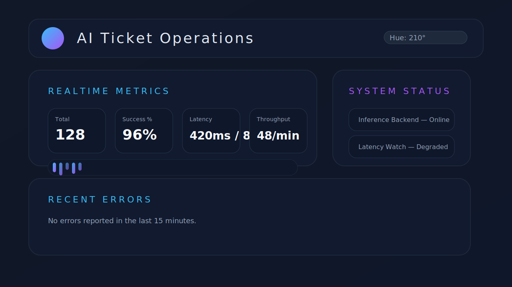

# AI Ticket Dashboard

The AI Ticket dashboard provides a dark-mode control plane for monitoring inference activity in real time. It is built with
React and Vite under `src/ai_ticket/ui/` and ships with hue-adjustable theming, keyboard shortcuts, and contextual help.



## Features

- **Realtime metrics stream** – live success rates, latency percentiles, throughput, and sparkline charts backed by
  server-sent events (`/api/metrics/stream`).
- **Status panels** – quick insight into backend health, latency budgets, and pipeline throughput derived from recent event
  telemetry.
- **Dark mode with accent control** – adjust the accent hue at runtime; the selection is persisted locally.
- **Keyboard shortcuts & overlays** – `Shift + /` toggles the shortcuts overlay, `Cmd/Ctrl + K` opens the command palette,
  navigation combos (`G` then `H/P/C`) switch dashboard views, and `R`/`H` still refresh metrics and cycle accent hues.
- **Command palette** – fuzzy-search quick actions (refresh, navigation, help) with `Cmd/Ctrl + K`, mirroring the keyboard
  roadmap for operators who prefer not to reach for the mouse.

## Running the dashboard locally

```bash
# install JavaScript dependencies
cd src/ai_ticket/ui
npm install

# start Vite dev server
npm run dev
```

The development server runs on [http://localhost:5173/dashboard/](http://localhost:5173/dashboard/) and proxies API calls to
the Flask backend.

To use the production build served by Flask:

```bash
# build the UI bundle
npm run build

# start the python app
pip install -e .
flask --app src.ai_ticket.server run
```

Then open [http://localhost:5000/dashboard](http://localhost:5000/dashboard).

## API endpoints

| Endpoint | Method | Description |
| --- | --- | --- |
| `/api/metrics/summary` | GET | Returns the latest metrics snapshot with totals, latency, throughput, and status panels. |
| `/api/metrics/stream` | GET | Server-sent events stream that pushes the snapshot whenever new activity is recorded. |
| `/event` | POST | Existing inference event handler that now feeds the metrics store. |
| `/dashboard` | GET | Serves the bundled dashboard assets from `src/ai_ticket/ui/dist`. |

## Keyboard shortcuts & help overlay

The help dialog lists available shortcuts and explains the dashboard layout. Press `Shift + /` to open the dialog, `Esc` or
`Close` to dismiss it, and use `Cmd/Ctrl + K` to search the command palette. Shortcuts are ignored while typing in input
fields.

## Docker workflow integration

The Dockerfile installs Node.js, builds the Vite bundle, and removes development dependencies before packaging the Python
application. Run the service as usual and the dashboard will be available at `/dashboard` inside the container.

```bash
docker build -t ai-ticket .
docker run -p 5000:5000 ai-ticket
```

## Screenshot generation

The `docs/ui/screenshots/dashboard-dark.svg` file captures the dashboard layout and theming. Update it if the UI changes.
